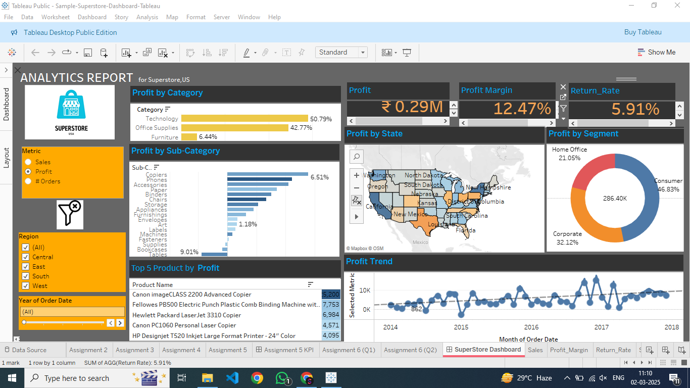

# 📊 Superstore Sales Dashboard - Tableau  

## 📌 Overview  

The **Superstore Sales Dashboard** is an interactive **Tableau dashboard** designed for **sales and profit analysis**. It provides insights into **profitability, sales trends, product performance, and regional distribution**. The dashboard enables users to explore data dynamically using filters and visual analytics.  

## ✅ Features  

- 📈 **Profit Analysis**: Breakdown by **Category, Sub-Category, and State**  
- 🛍 **Sales Performance**: Monthly trends and **top-performing products**  
- 🌎 **Geographical Insights**: Sales and profit analysis across different **regions**  
- 🎯 **Customer Segmentation**: Breakdown by **Consumer, Corporate, and Home Office**  
- 📊 **Interactive Filters**: Drill down by **Year, Region, and Product Category**  

## 🛠 Tech Stack  

### 📊 Dashboard  
- **Tableau Public** / **Tableau Desktop**  

### 📂 Data Source  
- **Superstore Sales Dataset** (Sample)  

## 📥 Installation and Setup  

### ⚙️ Prerequisites  
Ensure you have **Tableau Public** or **Tableau Desktop** installed:  
🔗 [Download Tableau Public](https://public.tableau.com/en-us/s/download)  

### 🚀 How to Open the Dashboard  

1. 📥 **Download** the `Superstore-Dashboard-Tableau.twbx` file  
2. 📂 **Open it in Tableau Public / Tableau Desktop**  
3. 🧐 **Explore interactive visualizations** using filters  

## 🎯 Dashboard Insights  

- **Profitability Breakdown**: Identify which **categories, sub-categories, and states** generate the most profit  
- **Top 5 Products**: View the **most profitable products**  
- **Regional Performance**: Understand how different regions contribute to overall sales  
- **Sales Trends**: Analyze historical trends over time  

## 📷 Dashboard Preview  

  

## 🔗 Related Resources  

- 📊 [Tableau Official Documentation](https://help.tableau.com/)  
- 🏆 [Sample Superstore Dataset (Kaggle)](https://www.kaggle.com/datasets) *(if applicable)*  
